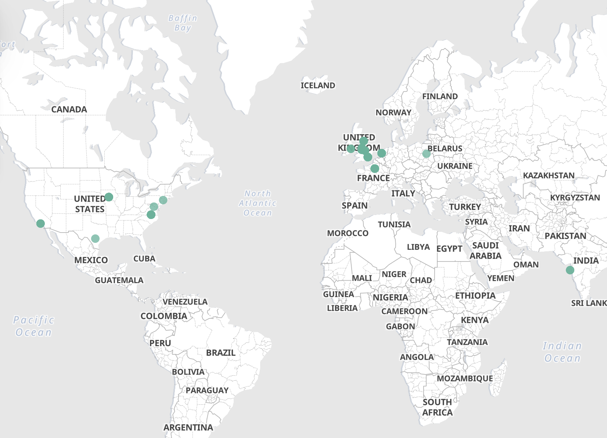
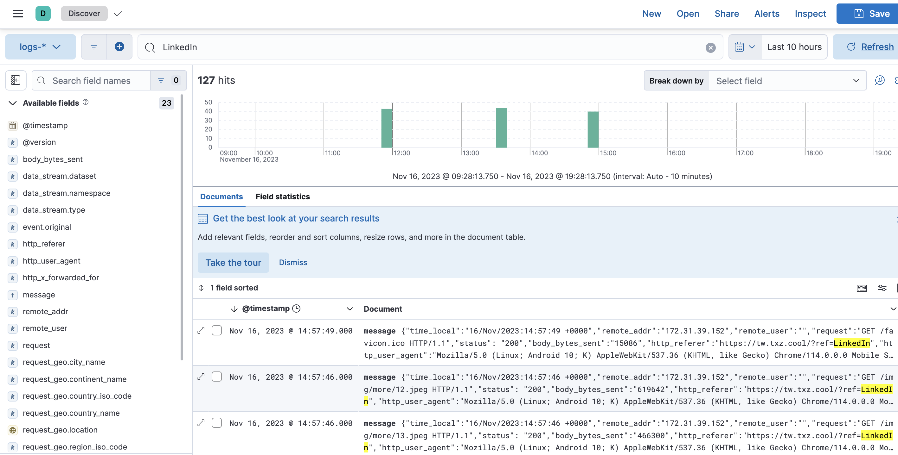

# (Weekly-Share) 探索ELK：高效的日志管理与分析解决方案 - 以我个人网站为例

---

## 简介

在数据驱动的时代，有效地管理和分析日志数据变得至关重要。ELK堆栈，由Elasticsearch、Logstash和Kibana三个强大的开源工具组成，提供了一个全面的解决方案，旨在简化和优化大规模数据的处理和可视化。

**E - Elasticsearch** 是一个高性能的搜索和分析引擎。它使得存储、搜索和分析大量数据变得轻而易举，不仅快速而且非常灵活。

**L - Logstash** 负责数据的处理。它能够收集来自不同来源的数据，然后转换和传输到Elasticsearch。Logstash的强大之处在于其灵活性和扩展性，可以轻松处理各种格式和复杂的数据流。

**K - Kibana** 则是这一堆栈的可视化组件。它允许用户以图形化方式展示和分析Elasticsearch中的数据。通过Kibana，复杂的数据集可以转换成直观的图表和仪表板，使得数据分析更加直观和易于理解。

**ELK**提供了一种高效、灵活的方式来处理和分析大量数据，适用于各种规模的组织和多种应用场景。无论是监控IT基础设施、分析客户行为，还是实时数据分析，ELK都是一个值得考虑的强大工具。

## 我的需求

目前我的个人网站是以Docker镜像的方式部署在一台服务器中，每天会有大量访问日志产生。用传统的方式登录到服务器上查看日志不仅费时费力，也无法对信息进行有效的搜索和分析。我希望通过某种方式让我快速了解到我个人网站的访问数据，同时需要保证服务器数据的安全。

## 方案实施

在ELK使用初期，其最大的问题是复杂的环境配置和系统搭建。但Docker技术可以很好的解决这一问题，[docker-elk](https://github.com/deviantony/docker-elk)
的贡献者们提供了很好的配置文件来大众可以快速的启动一个ELK服务（重要的事情：用于商业生产环境前请确保你足够了解ELK）。

在服务架设好之后，需要根据特定的需求来调整LogStash以及Kibana的设置。因为我的需求涉及到将IP转换为地理位置，我创建了一个结合Elasticsearch内置的geoip处理器创建了一个pipeline进行数据的转换，同时给Kibana对应的Data
View设置了一个额外的字段来让可视化组建能够识别到请求的地理位置。整体的方案以及相关配置文件我放在了本项目中。

## 具体步骤; 视频可见[Record](record/record.mp4)

### 1. 前置条件 (点击即可跳转安装教程)

1. [docker](https://docs.docker.com/engine/install/)
2. [docker-compose](https://docs.docker.com/compose/install/)
3. [git](https://git-scm.com/book/en/v2/Getting-Started-Installing-Git)

```shell
# 克隆 docker-elk仓库
git https://github.com/deviantony/docker-elk.git
cd ./docker-elk

# 启动前置任务, 设置一些必要的环境
docker-compose up setup

# 启动ELK
docker-compose up
```

2. 部署完成后可以通过 http://localhost:5601 访问kibana, 已经设置好了Elasticsearch, kibana, logstash三者的连接。

- Username: elastic
- password: changeme

### 3. 给es添加pipeline，可以跟着[Record](record/record.mp4)做

```shell
PUT _ingest/pipeline/geoip-pipeline
{
  "description": "Add geospatial fields",
  "processors": [
    {
      "geoip": {
        "field": "http_x_forwarded_for",  // 替换为你的地理位置字段
        "target_field": "request_geo"  // 替换为你想要创建的新字段
      }
    }
  ]
}
```

### 4. 按照 [logstash.conf](scripts/logstash.conf) 调整pipeline

### 5. 重启 logstash

```shell
docker restart docker-elk-logstash-1
```

### 6.导入数据

```shell
#通过logstash导入数据到Elasticsearch中
cat access.log | nc -c localhost 50000
```

### 7. 跟随[Record](record/record.mp4)设置地图

### 后续操作-关闭所有容器并清除Volume

```shell
# 会清除所有的数据和容器
docker-compose down -v
```

## 成果展示




## 下一个分享：

Docker, Java 或者 任何你感兴趣的主题 (请以任何方式提出)