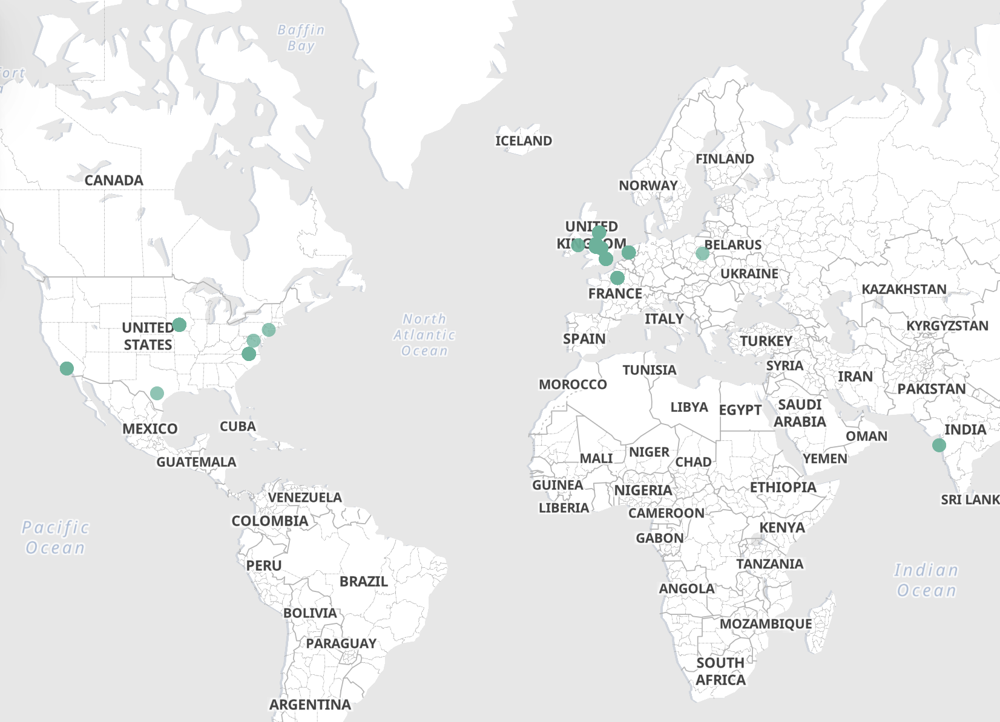
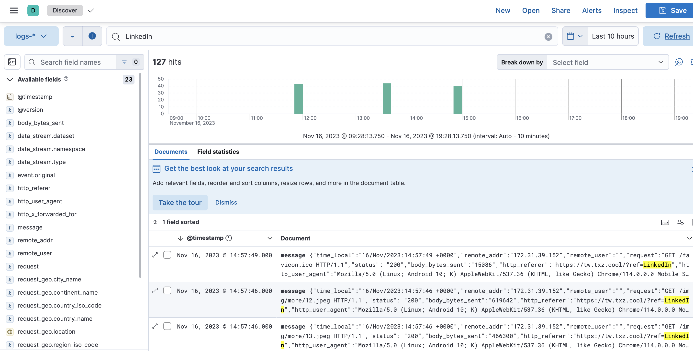

# Explore ELK: An efficient log management and analysis solution - My personal portfolio as an example

---

## Introduction

In the era of data-driven, effectively managing and analyzing log data has become crucial. The ELK
stack, comprising Elasticsearch, Logstash, and Kibana, three powerful open-source tools, offers a comprehensive solution
aimed at simplifying and optimizing the processing and visualization of large-scale data.

**E - Elasticsearch** is a high-performance search and analysis engine. It makes storing, searching, and analyzing vast
amounts of data easy, not only fast but also highly flexible.

**L - Logstash** is responsible for data processing. It can collect data from various sources, then transform and
transfer
it to Elasticsearch. The strength of Logstash lies in its flexibility and scalability, easily handling various formats
and complex data streams.

**K - Kibana** is the visualization component of this stack. It allows users to graphically present and analyze data in
Elasticsearch. With Kibana, complex data sets can be transformed into intuitive charts and dashboards, making data
analysis more straightforward and comprehensible.

**ELK** offers an efficient and flexible way to handle and analyze large amounts of data, suitable for organizations of
all
sizes and various application scenarios. Whether it's monitoring IT infrastructure, analyzing customer behavior, or
real-time data analysis, ELK is a powerful tool worth considering.

## My Requirement

My personal portfolio is currently deployed on a server as a Docker image, generating a large amount of access logs
daily. Traditional methods of logging into the server to view logs are not only time-consuming but also ineffective for
information searching and analysis. I want to have a quick way to understand the access data of my personal website
while ensuring the security of server data.

## Implementation Plan

Initially, the biggest issue with ELK was complex environment configuration and system setup. However, Docker
can effectively solve this problem. The contributors of [docker-elk](https://github.com/deviantony/docker-elk) have
provided excellent configuration files that allow the public to quickly start an ELK service (important note: ensure you
are sufficiently familiar with ELK before using it in a commercial production environment).

After setting up the service, it's necessary to adjust the settings of LogStash and Kibana according to specific
requirements. Since my requirement involves converting IP to geographic location, I created a pipeline that integrates
the Elasticsearch's built-in geoip processor for data transformation. I also added an extra field to the corresponding
Data View in Kibana to allow the visualization component to recognize the geographical location of requests. I have
placed the overall solution and related configuration files in my project weekly-share.

## Specific Steps; Video see [Record](record/record.mp4)

### 1. Prerequisites (click for installation tutorials)

1. [docker](https://docs.docker.com/engine/install/)
2. [docker-compose](https://docs.docker.com/compose/install/)
3. [git](https://git-scm.com/book/en/v2/Getting-Started-Installing-Git)

```shell
# Clone the docker-elk repository
git https://github.com/deviantony/docker-elk.git
cd ./docker-elk

# Start the preliminary tasks, set up some necessary environment
docker-compose up setup --force-recreate

# Start ELK
docker-compose up
```

2. After deployment, Kibana can be accessed at http://localhost:5601. The connections between Elasticsearch, Kibana, and
   Logstash are already set up.

- Username: elastic
- password: changeme

### 3. Add pipeline to ES, Could follow the [Record](record/record.mp4)

```shell
PUT _ingest/pipeline/geoip-pipeline
{
  "description": "Add geospatial fields",
  "processors": [
    {
      "geoip": {
        "field": "http_x_forwarded_for",  // Replace with your geographical location field
        "target_field": "request_geo"  // Replace with the new field you want to create
      }
    }
  ]
}
```

### 4. Adjust pipeline according to [logstash.conf](scripts/logstash.conf)

### 5. Restart logstash

```shell
docker restart docker-elk-logstash-1
```

### 6. Import data

```shell
# Import data into Elasticsearch through logstash
cat access_filtered.log | nc -c localhost 50000
```

### 7. Follow [Record](record/record.mp4) to set up visualization map.

### Follow-up Action - Shut down all containers and clear Volume

```shell
# This will clear all data and containers
docker-compose down -v
```

## Outcome Display




## Next Share:

Docker, Java, or any topic of your interest (please propose in any way)